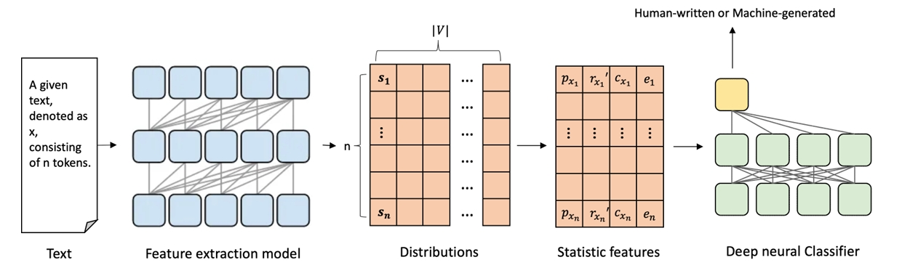

# STADEE
The emergence of large-scale pre-trained language models (PLMs), such as ChatGPT, creates opportunities for malicious actors to disseminate disinformation, necessitating the development of automated techniques for detecting machine-generated content. However, current approaches, which predominantly rely on fine-tuning a PLM, face difficulties in identifying text beyond the scope of the detector’s training corpus.

we introduce STADEE, a **STA**tistics-based **DEE**p detection method with high generalization that integrates essential statistical features(Probability, Rank, Cumulative probability, Information entropy) of text with a sequence-based deep classifier.

